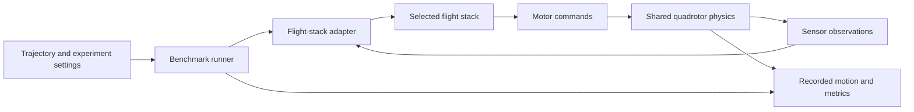

# Autonomous Drone Racing Benchmark

A software-in-the-loop benchmark for comparing **Betaflight, CogniPilot, PX4,
and ArduPilot** on the same simulated racing drone.

The research question is: **how accurately and consistently can each flight
stack follow the same trajectory under the same conditions?** The semester
focus is a working software simulation benchmark. Hardware-in-the-loop is a
stretch goal, using as much of the same infrastructure as possible.

**Current milestone:** CogniPilot and ArduPilot both fly using the same
Rumoca-generated quadrotor physics model. ArduPilot completes a bounded square
flight and produces tracking measurements. Both stacks now consume the same timed square reference. Takeoff/landing and
sensor paths still differ, so these runs do **not** establish which stack
performs best.

## What this project does

The simulator acts as the drone: it produces sensor readings, receives motor
commands from the flight software, and calculates the resulting motion. The
runner records the flight so performance can be measured and experiments can
be repeated.



One stack runs at a time. The intended adapters select Betaflight, CogniPilot,
PX4 or ArduPilot while retaining the same plant and experiment definition.
The current CogniPilot and ArduPilot connections implement the beginning of
this architecture; the other two adapters remain to be built.

The eventual comparison must hold these conditions constant:

- Trajectory, starting position and attitude, and control level being tested.
- Quadrotor dynamics, motor order, actuator limits and command interpretation.
- Sensor models, update rates, noise, delays and disturbances.
- Simulation clock, logging definitions and evaluation windows.

Shared physics and square-reference commands are working for two stacks.
Matching sensor conditions and takeoff/landing remain active development work.

## Current implementation

| Flight stack | Implemented and exercised | Remaining work |
| --- | --- | --- |
| **CogniPilot** | Zephyr `native_sim` firmware, shared-memory lockstep, common FMI plant, existing 44-second flight qualification | Shared reference now connected; remove or standardize simulator-assisted takeoff for comparison |
| **ArduPilot** | Copter 4.7.1 JSON SITL adapter, disarmed connection probe, MAVLink Guided commands, 145-second bounded flight diagnostic | Align sensors, command timing and actuator interpretation with the other stacks |
| **PX4** | Architecture candidate identified | Implement and validate adapter |
| **Betaflight** | Architecture candidate identified | Implement and validate adapter at an appropriate common control level |

The project builds on the **CogniPilot development workspace**. Modelica defines
the plant, Rumoca compiles it into an FMI simulation artifact with generated C,
and the native Rust runner exchanges sensor and actuator data with flight
software. Devenv coordinates dependencies and tasks; each source repository
retains its own native build workflow.

## Results demonstrated so far

These are recorded simulation results, not physical flight measurements.

| Evidence | Observed result |
| --- | --- |
| CogniPilot baseline | 44 simulated seconds; takeoff, square flight, landing and disarming pass |
| CogniPilot regression | Recorded trajectory remains byte-identical after adding the ArduPilot diagnostic |
| ArduPilot connection probe | 8,000 contiguous steps at 1,600 Hz, with no motor actuation |
| ArduPilot Guided flight | 232,000 contiguous steps over 145 simulated seconds; takeoff, square, landing and disarming pass |
| ArduPilot position tracking | 0.06252 m RMS error; 0.09441 m maximum error over the 25-second square-and-hold window |
| Motor response checks | All four rotors produce the expected roll, pitch and yaw response signs |
| Shared-reference diagnostic | Both stacks receive 500 matching position/velocity/yaw samples; CogniPilot RMS error 0.04715 m, ArduPilot 0.06252 m; sensor parity remains unqualified |
| Native unit/protocol tests | 37 tests pass, plus two explicitly run native firmware integration tests |

The ArduPilot reference is a **0.5 m square at 1.5 m altitude**, with four
five-second minimum-jerk edges and a five-second hold. Its 145-second run
includes a 90-second estimator warmup. Normal arming checks remain enabled.
Simulation seconds describe the vehicle's simulated clock, not the computer's
execution time.

The tracking figures are 3D distances between plant position and the continuous
commanded reference, sampled during simulation time 110–135 seconds. They are
single-run diagnostic measurements, not comparative scores. The new
[shared-reference diagnostic](docs/shared-reference.md) scores both stacks over
the same 25-second reference, with estimator-origin conversion for CogniPilot.
CogniPilot's
existing baseline uses its own planner and a simulator-assisted takeoff law;
its navigation-estimate error is a different measurement and must not be
compared with ArduPilot's trajectory-tracking RMS error.

The pure Modelica qualification is still blocked by a packaged-runtime crash
and separate estimator qualification failures. Passing SIL does not resolve
those issues. See [verified results and limitations](docs/rdd2-validation.md).

## Run the work

The exercised environment is an Ubuntu 24.04 ARM64 Linux VM. Start from this
repository, rather than cloning another CogniPilot workspace inside it:

```sh
git clone https://github.com/An1Sura/autonomous-drone-bench.git
cd autonomous-drone-bench
./setup rdd2
```

On a **fresh checkout**, first follow the [dependency patch instructions](patches/README.md)
to obtain the tested source revisions and apply the benchmark changes. The
editable dependencies live under `src/`; this repository preserves the native
runner changes as patches against documented commits. The existing development
VM already has those patches applied.

Inside the configured RDD2 environment:

```sh
# Exercise the shared boundary, protocol and reference tests.
devenv -P rdd2 tasks run rdd2:benchmark:test

# Run the existing CogniPilot simulated flight.
devenv -P rdd2 tasks run rdd2:simulation:sil:test
```

Build the pinned ArduPilot binary using the [ArduPilot setup guide](docs/ardupilot-adapter.md),
then run:

```sh
# Runs CogniPilot SIL, the disarmed connection probe, then the Guided flight.
devenv -P rdd2 tasks run rdd2:benchmark:ardupilot:flight
```

Run one ArduPilot diagnostic at a time. The native Cargo and Waf workflows are
also documented in the guide; Devenv does not replace those project tools.

### Where the results go

| Location | Contents |
| --- | --- |
| `src/cerebri_rdd2/artifacts/sil/` | CogniPilot report and recorded flight trajectory |
| `src/cerebri_rdd2/artifacts/ardupilot-probe/run-*/` | Disarmed probe report and firmware log |
| `src/cerebri_rdd2/artifacts/ardupilot-flight/run-*/` | Flight report, measured trajectory, commanded trajectory, firmware log and exact parameters |

Each flight report records plant and executable fingerprints, simulation step
counts, exchange timing and completion or failure information. The trajectory
CSV contains time, position and orientation. Raw run artifacts and generated
binaries remain local; they are not committed as source code.

To run both stacks on the shared square reference, see the
[shared-reference guide and recorded results](docs/shared-reference.md).

## What comes next

1. Extend the shared-reference diagnostic toward a qualified navigation-control
   experiment with matched sensor delivery and documented frame semantics.
2. Align sensor injection, noise, delay, initial conditions and actuator
   interpretation; standardize takeoff and landing behavior.
3. Implement and validate PX4 and Betaflight adapters without introducing
   separate physics models.
4. Run repeatable experiments and gain sweeps, reporting trajectory error,
   overshoot, settling time, actuator saturation, latency and jitter.
5. Add completion time and racing trajectories, then explore hardware-in-the-loop
   and motion-capture validation as later milestones.

Current exchange timing includes transport and host scheduling. Isolated
controller execution time, configurable shared disturbances, and a qualified
four-stack ranking remain future work.

## Project guides

- [Shared-reference flights and results](docs/shared-reference.md)
- [Common benchmark architecture and interface](docs/common-benchmark.md)
- [ArduPilot setup, commands and diagnostic limits](docs/ardupilot-adapter.md)
- [Verified results and unresolved blockers](docs/rdd2-validation.md)
- [Tested dependency revisions and patches](patches/README.md)
- [RDD2 workflow reference](docs/rdd2.md)

<details>
<summary>Underlying CogniPilot workspace reference: profiles, tools and maintenance</summary>

This repository is based on the [Devenv](https://devenv.sh/) workspace for
editable CogniPilot development. Devenv selects tool environments, schedules the task
DAG, supervises processes, installs workspace hooks, and integrates the public
Cachix caches. Each repository continues to own its Cargo, npm, CMake, West,
colcon, Meson, and Nix behavior.

Using this workspace is optional. A developer working in one repository can
install that project's native prerequisites and use `west`, Cargo, npm, CMake,
or its other native tools directly. Project flakes are an opt-in reproducible
way to obtain those tools and run project-owned applications. The root Devenv
is the additional opt-in layer for composing editable repositories and running
their cross-project dependency graph.

## Five-minute start

Install Git and curl, clone this repository, and pass the desired development
profile to `setup`. For RDD2 development:

```sh
./setup rdd2
# Inside the RDD2 shell opened by setup:
devenv tasks run rdd2:firmware:build
```

`setup` installs Nix when necessary, installs the workspace's pinned Devenv
release, saves the requested profile in the ignored `devenv.local.yaml`, and
enters it with `devenv shell`. The local selection makes later unqualified
`devenv` commands use the same profile. If a local file already exists with
another configuration, `setup` leaves it untouched and asks you to update it
explicitly. Run plain `./setup` to list the available profiles without entering
a shell. Project tasks automatically clone any missing editable repositories
into `src/`, then reuse those checkouts on later runs. Run `sources:sync`
explicitly to fetch each repository's configured branch; it never changes an
existing checkout's active branch.
Most repositories use `main`; FastDyn temporarily starts at a verified revision
of its external-configuration branch while the generic installation-root
support is being upstreamed. Source sync fetches newer branch work without
moving an existing checkout.

Choose the work area you use most often in the ignored local configuration:

```yaml
# devenv.local.yaml
profile: cubs2
```

Then either enter it explicitly:

```sh
devenv shell
```

or enable Devenv's native automatic activation. Add the appropriate hook to
your shell configuration, restart the shell, and trust this checkout once:

```sh
# ~/.bashrc
eval "$(devenv hook bash)"

# ~/.zshrc uses: eval "$(devenv hook zsh)"
devenv allow
```

After that, entering the workspace activates the selected local profile and
leaving it deactivates the environment. No direnv installation is required.

If Nix reports that cache settings are restricted, trust the public caches once
at the host level. These commands prompt for elevation when required:

```sh
nix run nixpkgs#cachix -- use cognipilot
nix run nixpkgs#cachix -- use devenv
nix run nixpkgs#cachix -- use ros
```

## Pick a profile

Profiles are developer work areas. Internal Rust, Web, Zephyr, and diagnostics
tool modules are composed into these profiles instead of being exposed as more
choices.

| Profile | Use it for | Good first command |
| --- | --- | --- |
| `synapse` | Synapse schema and generated packages | `tasks run synapse-fbs:test` |
| `modelica` | Rumoca and Modelica integration | `tasks run modelica-models:test` |
| `electrode` | Electrode ground-station code | `tasks run electrode-web:test` |
| `qualisys` | Qualisys SDK and bridge | `up synapse-qualisys-bridge` |
| `ppm` | Synapse-to-PPM bridge | `up synapse-ppm-bridge` |
| `zros` | ZROS, CSyn, and Cerebri Zephyr modules | `tasks run zros:test` |
| `ros2` | CSyn ROS 2 bridge | `tasks run ros2:test` |
| `cubs2` | CUBS2 firmware, SIL/BIL simulation, and aircraft deployment | `tasks run cubs2:simulation:sil:test` |
| `rdd2` | RDD2 model, firmware, SIL/BIL, and deployment development | `tasks run rdd2:simulation:sil:test` |
| `fastdyn` | FastDyn C/C++, Rust, and Python work | `tasks run fastdyn:test` |
| `release` | Cross-project qualification without publishing | `tasks run release:all` |
| `workspace` | Every tool and the published OCI shell | `container build shell` |
| `ci` | Minimal workspace configuration validation | `test` |

The example column is the portion after `devenv -P <profile>`. With a
default in `devenv.local.yaml`, omit `-P <profile>`:

```sh
devenv tasks list
devenv tasks run cubs2:simulation:sil:test
devenv up
```

For a one-off different environment, override the local default:

```sh
devenv -P modelica shell
devenv -P rdd2 tasks run rdd2:simulation:bil:test
```

Task discovery is profile-scoped. The base environment shows only source and
workspace maintenance; each work profile adds the development tasks supported
by its tools. Publication and cross-project qualification tasks appear only in
the `release` and `workspace` profiles.

Devenv 2.2.1 has a profile-completion limitation: task completion always reads
the base `.devenv/task-names.txt`, even when `-P` or `devenv.local.yaml` selects
another profile. `devenv tasks list` and task execution honor the selection,
but tab completion can still show the base tasks. Use the selected profile's
task list as the authoritative task inventory.

Tasks that operate on an editable repository take a cross-process repository
lock. Two agents can build different repositories concurrently, but tasks for
the same repository wait rather than writing its build tree at the same time.
An actual wait is announced with prominent `WAITING FOR REPOSITORY LOCK` and
`ACQUIRED REPOSITORY LOCK` banners, including the holder PID when available.
Cancelling a waiter does not leave a stale lock; the operating system releases
the advisory lock with its process. These locks coordinate Devenv invocations
from this workspace. Direct Cargo, West, CMake, npm, and other native commands
remain independent and responsible for their project-owned build directories.

### Terminal accessibility

This workspace defaults to Devenv's plain renderer because the interactive
display retains only a short tail of failed task output and fixes its failure
color to ANSI color 160. Plain output preserves complete chronological errors
and uses the terminal's configurable standard colors. To opt back into the
interactive display for the current session:

```sh
export DEVENV_TUI=true
```

Configure the terminal's normal ANSI red to a brighter or color-blind-friendly
color. With the interactive display, configure indexed color 160 instead; the
exact setting depends on the terminal emulator.

### Exact tasks and namespaces

Always use the complete task name shown by `devenv tasks list`. In Devenv, a
bare namespace such as `devenv tasks run cubs2` means "run every task whose
name begins with `cubs2:`"; it is not an alias for the usual build.

Use the exact flash task rather than a namespace. CUBS2 requires an explicit
confirmation input; RDD2 starts its project-owned flash command immediately:

```sh
devenv -P cubs2 tasks run cubs2:firmware:flash --input confirm=true
devenv -P rdd2 tasks run rdd2:firmware:flash
```

## Common work

Use one `cubs2` profile for the complete vehicle workflow:

```sh
devenv -P cubs2 tasks run cubs2:simulation:modelica:test
devenv -P cubs2 tasks run cubs2:simulation:sil:test
devenv -P cubs2 tasks run cubs2:simulation:bil:test
devenv -P cubs2 tasks run cubs2:simulation:compare
devenv -P cubs2 tasks run cubs2:firmware:build
devenv -P cubs2 tasks run \
  cubs2:firmware:flash --input confirm=true
devenv -P cubs2 up
```

The first command runs the pure Modelica controller and physics with Rumoca.
The second runs the CUBS2 64-bit Zephyr `native_sim` controller against Rumoca
physics. The third rehosts the Cortex-M7 binary under FastDyn/QEMU and retains
Rumoca physics. The fourth runs all three and gates their overlaid canonical
trajectory logs. The fifth builds the aircraft image without touching hardware.
The confirmed flash command deploys that firmware, and `up` runs the
operator-side Electrode ground station plus its PPM bridge. See the
[CUBS2 developer workflow](docs/cubs2.md) for firmware configuration, 32-bit
compatibility, UI-only simulation, Qualisys, process arguments, artifacts, and
deployment operations.

Use the same workflow shape for RDD2:

```sh
devenv -P rdd2 tasks run rdd2:simulation:modelica:test
devenv -P rdd2 tasks run rdd2:simulation:sil:test
devenv -P rdd2 tasks run rdd2:simulation:bil:test
devenv -P rdd2 tasks run rdd2:simulation:compare
devenv -P rdd2 tasks run rdd2:firmware:build
```

SIL runs a host-built Zephyr binary with Rumoca physics; BIL rehosts the
Cortex-M7 hardware binary with FastDyn/QEMU and also uses Rumoca physics. Pure
Modelica runs both control and physics in Rumoca without Zephyr. See
[Vehicle firmware and simulation](docs/vehicle-development.md) and the
[RDD2 developer workflow](docs/rdd2.md) for the exact current capability
boundary.

The first vehicle build initializes only that vehicle's isolated West
workspace and clones its missing editable source dependencies. Later builds
reuse both. Fetch the current revisions from the project-owned manifest
explicitly when desired:

```sh
devenv -P cubs2 tasks run cubs2:workspace:update
devenv -P rdd2 tasks run rdd2:workspace:update
```

After `cubs2:firmware:build`, the principal firmware files are:

```text
src/cerebri_cubs2/build-mr_vmu_tropic/zephyr/zephyr.elf
src/cerebri_cubs2/build-mr_vmu_tropic/zephyr/zephyr.bin
```

`zephyr.elf` is the linked ARM executable with debug symbols; `zephyr.bin` is
the raw flash image. This board configuration does not emit a HEX file.

The CUBS2 flash task uses pyOCD by default. Select another board-supported
runner with `CUBS2_FLASH_RUNNER`, or set it to an empty string to let Zephyr
choose:

```sh
CUBS2_FLASH_RUNNER=jlink devenv -P cubs2 tasks run \
  cubs2:firmware:flash --input confirm=true
```

Build or test the ground station without the full CUBS2 tool environment:

```sh
devenv -P electrode tasks run electrode-web:build
devenv -P electrode tasks run electrode-web:test
```

For native Rumoca development, install the prerequisites documented by Rumoca
and use its Cargo interface directly:

```sh
cd src/rumoca
cargo build --workspace
cargo xtask --help
cargo xtask vscode edit
```

Opt into Rumoca's project-owned flake when you want the exact reproducible
nightly toolchain, components, WASM target, Node release, and native libraries:

```sh
cd src/rumoca
nix develop
cargo xtask verify quick
```

The root `modelica` profile is the cross-repository integration environment:

```sh
devenv -P modelica tasks run rumoca:compiler
devenv -P modelica tasks run modelica-models:test
devenv -P modelica tasks run modelica-models:cubs2:qualify
devenv -P modelica tasks run modelica-models:rdd2:qualify
```

This is the aerospace-engineering home: reusable vehicle templates, named
CUBS2/RDD2 parameters, controllers, contact physics, missions, and FMI/eFMI
exports all live in `src/modelica_models`. Execution-mode names begin only at
the firmware and workspace integration boundary.

More goal-oriented command sequences are in
[Development workflows](docs/workflows.md).

## Run supervised processes

Run the deployed CUBS2 ground-station stack in the foreground with the native
Devenv process manager:

```sh
devenv -P cubs2 up
```

This starts `electrode-ground-station`, waits for its health endpoint, and then
starts `electrode-ppm-bridge` against its allocated Zenoh endpoint. It expects
the configured PPM serial device.

Run the operator UI with a no-serial fake vehicle instead of aircraft firmware:

```sh
PPM_NO_SERIAL=true devenv -P cubs2 up \
  electrode-ground-station electrode-ppm-bridge electrode-fake-vehicle
```

Select other focused process entry points when needed:

```sh
devenv -P qualisys up synapse-qualisys-bridge
devenv -P ppm up synapse-ppm-bridge
```

Use detached mode when you want to inspect or control processes from the same
terminal:

```sh
devenv -P cubs2 up -d
devenv -P cubs2 processes wait --timeout 300
devenv -P cubs2 processes list
devenv -P cubs2 processes logs electrode-ground-station
devenv -P cubs2 processes restart electrode-ppm-bridge
devenv -P cubs2 processes down
```

The CUBS2 PPM bridge defaults to `/dev/ttyACM0`; override it with
`PPM_SERIAL_DEVICE`. Its Zenoh connection follows the port allocated to the
ground station.

See [Supervised development processes](docs/processes.md) for the available
process matrix, startup lifecycle, process-versus-task guidance, and proposed
hardware-free development additions.

## Source and build boundaries

Every editable repository remains under `src/`. CUBS2 and RDD2 each own their
checked-in `west.yml` and use an isolated workspace under
`.devenv/state/west/`. The root never creates shared `.west/`, `zephyr/`,
`modules/`, or `models/` trees.

Cross-repository task edges generate local Synapse and Rumoca artifacts before
passing their editable paths to downstream native tools. Mutable Cargo targets,
node modules, West workspaces, and build directories remain outside the Nix
store and retain native incremental behavior. Shared ccache and sccache state
lives below `.devenv/cache/`.

These task edges apply only when invoking Devenv. They do not replace a
vehicle's standalone West workflow or make Nix a prerequisite for building its
Zephyr application outside this workspace.

See [Project environments](docs/project-environments.md) for the detailed
project-flake boundary.

## Qualify and publish the workspace environment

```sh
devenv -P release tasks run release:qualify
devenv -P release tasks run release:all
```

These commands qualify integrations, packages, and firmware without publishing
project releases. Each project remains responsible for its own release tag and
publication workflow.

A workspace `vX.Y.Z` tag has a separate purpose: CI qualifies the workspace,
builds the complete `workspace` profile as a Devenv OCI shell container, and
publishes the version plus `latest` to GitHub Container Registry:

```sh
docker pull ghcr.io/cognipilot/cognipilot-workspace:v0.1.0
docker run --rm -it -v "$PWD:/env" \
  ghcr.io/cognipilot/cognipilot-workspace:v0.1.0
```

The container contains the immutable tool environment, never a snapshot of
editable sources or build trees. It is generated by `devenv container`; there
is no Dockerfile or second package graph.

## Maintain the workspace

```sh
devenv tasks run sources:status
devenv test
devenv changelogs
devenv update
devenv gc
```

`devenv test` validates the configuration and runs the root hooks. CI also
evaluates every supported profile on x86_64 Linux, AArch64 Linux, and
Apple-silicon macOS. Zephyr firmware execution and flashing remain
Linux/hardware-specific.

The `cognipilot` and `ros` Cachix caches provide Nix-built environments and
packages. Native editable outputs are intentionally not Cachix artifacts.
`CACHIX_AUTH_TOKEN` is a CI write credential only and is not required for public
cache downloads.

</details>
