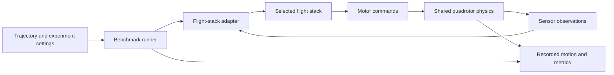

# Autonomous Drone Racing Benchmark

**Our goal is to make CogniPilot fly the same figure-eight course faster than Betaflight while maintaining accurate, reliable flight.**

Betaflight is the performance baseline; CogniPilot is the stack we aim to improve. We plan to fly **two identical drones autonomously** on the same course, using repeatable measurements to determine whether our CogniPilot changes improve performance and ultimately surpass that baseline. Faster flight must still meet the same tracking and completion requirements.

**This repository is the SIL stage before our separate latency tests.** It establishes working autonomous flights, shared physics, command interfaces and recorded baseline behavior. Subsequent latency tests will investigate control, communication and driver timing to guide CogniPilot improvements. The current flight recordings do not isolate those latencies or prove that CogniPilot is already faster. Hardware-in-the-loop (HIL) and physical flights at PURT build on this foundation.

[**Watch the Flight Simulation & Stats page**](https://an1sura.github.io/autonomous-drone-bench/sim/) · [Open the VM-connected simulation](http://127.0.0.1:8766/sim/) · [Read the speed-benchmark plan](docs/speed-benchmark.md)

**Current milestone:** both real flight-stack executables have flown a figure eight on the same Rumoca-generated quadrotor model. The latest Betaflight recording passes the one-lap geometric check, lands and disarms; CogniPilot passes its timed-reference diagnostic. These demonstrate the connections and recorded flights. **We have not yet measured either stack's maximum valid racing speed or established a winner.**

## What this project does

The simulator acts as the drone: it produces sensor readings, receives motor commands from the flight software, and calculates the resulting motion. The runner records the flight so performance can be measured and experiments repeated.



One stack runs at a time. Selecting Betaflight or CogniPilot changes the flight software and its adapter; it does not select an unrelated physics simulator. The adapter translates observations, reference commands and motor outputs between the runner and each stack's own interfaces.

The comparison must hold these conditions constant:

- Course geometry, initial position and attitude, and the control level being tested.
- Vehicle mass, inertia, propulsion model, motor order and actuator limits.
- Sensor models, update rates, noise, delays and disturbances.
- Lap start/finish rules, tracking tolerances, failure criteria and scoring windows.

Shared physics is working. Matching sensor conditions, reference timing and takeoff/landing remains active work. The physical drones are intended to be identical; the current RDD2 plant is a shared test vehicle, **not yet a measured calibration of those drones**.

## How SIL supports making CogniPilot faster

Keep the **same course size** for both stacks, then progressively shorten the requested lap duration. Document a reproducible Betaflight baseline, then evaluate CogniPilot improvements under the same vehicle and evaluation constraints. Do not shrink the path, skip a lobe or loosen the acceptance rules to get a faster result.

1. Establish a completed one-lap baseline with valid takeoff, tracking and landing.
2. Align the command interface, sensor conditions and lap-timing rules before ranking stacks.
3. Run a coarse sweep of shorter lap targets, then refine around the pass/fail boundary.
4. Repeat candidate settings and retain every failed attempt as well as successful ones.
5. Report CogniPilot's improvement relative to the documented Betaflight baseline, including accepted lap times, tracking error and failure rate. Keep baseline settings and tuning history explicit.

The lap clock measures **flight around the course**, separately from estimator warmup, arming, takeoff, end hold and landing. Total mission time is still reported. Simulation time is not the computer's execution time or the replay playback speed.

The acceptance thresholds, repeat count and common start/finish implementation still need to be fixed before a speed ranking. This procedure is the next benchmark milestone, **not an automated speed sweep already implemented in the current page**. See [the speed-benchmark definition and remaining work](docs/speed-benchmark.md).

## Current implementation

| Component | Implemented and exercised | Remaining work |
| --- | --- | --- |
| **CogniPilot** | Real Zephyr `native_sim` firmware, shared-memory lockstep, common plant, external timed figure-eight reference and recorded landing | Establish SIL baseline; use later latency tests to guide performance improvements; validate hardware feedback and timing/drivers |
| **Betaflight** | Pinned development SITL, sensor/motor exchange, native figure-eight pattern, independent recorded-lap check and landing/disarm checks | Support the common speed experiment; match sensors and timing; confirm the hardware firmware/interface |
| **Shared plant** | Modelica quadrotor dynamics compiled by Rumoca into a generated-C/FMI artifact | Calibrate mass, inertia, motor response and limits against the identical physical drones |
| **Simulation page** | Fixed one-lap PURT course, actual recordings, stats, black grid and green facility outline | Display future speed-sweep results once the runner and acceptance rules are implemented |
| **Formal mathematics** | 40 named Lean-checked benchmark theorems using `gnc_lean`; build and axiom audit pass | Numerical error bounds, implementation refinement and controller/hardware proofs remain outside current coverage |

## What the current recordings show

The course is **8 × 4 m**, at **1.5 m altitude**, with **one figure eight**, then landing. Betaflight is orange; CogniPilot is blue. The green PURT outline uses an approximate **53.34 × 28.956 × 9.144 m** envelope. Actual calibrated coverage and obstacle locations still need measurement.

| Stack | Current pattern timing | Full recorded run | Observed result |
| --- | --- | --- | --- |
| **Betaflight** | 25.132741 s native period; 25.2 s HOLD | 40.315 s | One geometric lap, zero extra quadrant gates, landed and disarmed |
| **CogniPilot** | 45 s reference, followed by a 5 s hold | 74.000 s | Reference diagnostic passed; 0.294747 m 3D tracking RMS over its scored window |

These are October 2 simulation recordings from run `1790925641463995931`, not physical-flight measurements. Recorded totals include setup and landing. **The table does not show Betaflight beating CogniPilot:** the two flights currently use different time laws, sensor paths and timing arrangements, and neither has undergone a maximum-speed search.

Betaflight's native planner has a 1 m/s cruise floor and a 0.25 rad/s pattern-rate cap. On this course, those produce the 25.13-second cycle. The old 45-second HOLD unintentionally commanded about 1.79 cycles; the corrected adapter requests 252 deciseconds and checks the recorded lap. That native planner cap is **not a measurement of Betaflight's ultimate control capability**. See [the timing diagnosis](docs/betaflight-timing.md).

Earlier [Betaflight tuning experiments](docs/betaflight-tuning.md) addressed simulated yaw/altitude oscillation without changing the shared plant. Intermittent estimator aborts and provisioning failures remain documented. Failed runs are preserved. The [current timing rundown](docs/timing-rundown.md) explains scoring and the limits of comparison.

## What the repositories and tools do

| Repository / tool | Role in this project |
| --- | --- |
| [This benchmark workspace](https://github.com/An1Sura/autonomous-drone-bench) | Experiment configuration, dependency patches, documentation, published recordings and site |
| [CogniPilot/cognipilot_workspace](https://github.com/CogniPilot/cognipilot_workspace) | Basis of this workspace's Devenv setup and development profiles |
| [CogniPilot/cerebri_rdd2](https://github.com/CogniPilot/cerebri_rdd2) | RDD2 firmware, native Rust simulation runner and patched benchmark interfaces |
| [CogniPilot/modelica_models](https://github.com/CogniPilot/modelica_models) | Modelica vehicle/plant definitions |
| [CogniPilot/rumoca](https://github.com/CogniPilot/rumoca) | Compiles the Modelica model into the simulation artifact used by the runner |
| [Betaflight](https://github.com/betaflight/betaflight) | Pinned flight-stack executable and its native SITL interfaces |
| [CogniPilot/gnc_lean](https://github.com/CogniPilot/gnc_lean) | Pinned verified mathematics used by our benchmark proof project |
| Zephyr, Devenv and native build tools | Firmware runtime, environment/task coordination, and project-owned builds |

Modelica defines the plant; Rumoca compiles it; the native Rust runner exchanges sensor and actuator data with the flight stack. Three.js displays the recorded positions and attitudes—it does not calculate the benchmark physics or invent a successful landing.

The [Lean coverage report](docs/formal-verification.md) explains the proofs of path closure, derivatives, smooth starts/stops, scaling laws, conditional containment and Betaflight timing. These proofs support the equations. They do not prove that either drone always tracks correctly, that PURT is safe to fly in, or that the current results form a fair ranking.

## Run the work

The exercised flight environment is an Ubuntu 24.04 ARM64 Linux VM. Use this repository as the workspace:

```sh
git clone https://github.com/An1Sura/autonomous-drone-bench.git
cd autonomous-drone-bench
./setup rdd2
```

On a fresh checkout, follow the [tested revision and patch instructions](patches/README.md). Editable dependencies live under `src/`; this repository preserves native runner changes as patches against documented commits. The existing development VM already has the patches applied.

Inside the RDD2 environment:

```sh
# Check the shared boundary, protocol and reference behavior.
devenv -P rdd2 tasks run rdd2:benchmark:test

# Run the current stack-specific figure-eight diagnostics.
devenv -P rdd2 tasks run rdd2:benchmark:betaflight:figure-eight
devenv -P rdd2 tasks run rdd2:benchmark:cognipilot:figure-eight

# Open the local simulation service; use Rerun both on its page.
devenv -P rdd2 up mission-planner
```

The service's internal process name is `mission-planner`; the user-facing page is **Flight Simulation & Stats**. It currently uses a fixed configuration with no editable stats controls. The local page reruns native firmware while the VM is on; GitHub Pages serves saved recordings. The [startup guide](docs/mission-planner.md) explains both.

The original qualification workflow remains available:

```sh
devenv -P rdd2 tasks run rdd2:simulation:modelica:test
devenv -P rdd2 tasks run rdd2:simulation:sil:test
devenv -P rdd2 tasks run rdd2:simulation:compare
```

These are qualification commands, not a claim that every qualification currently passes. Consult the [validation record](docs/rdd2-validation.md) and retain failed logs. Native Cargo and West workflows remain usable without Devenv. The separate [Lean project](proofs/README.md) uses `lake build`.

### Where the results go

| Location | Contents |
| --- | --- |
| `src/cerebri_rdd2/artifacts/mission-planner/<run-id>/` | Exact config, per-stack logs, reports and full recorded trajectories from the local service |
| `src/cerebri_rdd2/artifacts/sil/` | CogniPilot baseline SIL report and trajectory |
| `docs/results/single-lap/` | Current published replay data with native reports and final samples retained |
| `docs/results/betaflight-timing-fix/` | Compact records of successful and failed timing-fix attempts |
| `proofs/` | Lean source, pinned dependencies, axiom audit and verification record |

Reports preserve completion/failure details and plant/firmware fingerprints. Full native logs and generated binaries stay in the editable dependency workspace; selected reports and replay samples are committed for review.

## What comes next

1. Give both stacks a common speed-test reference and lap start/finish definition; resolve sensor and execution-timing differences.
2. Run the separate latency tests after the SIL baseline is established; use the findings to improve CogniPilot, then rerun flight tests and shorter-lap sweeps against the documented Betaflight baseline.
3. Identify hardware firmware/configuration and position feedback, then calibrate the plant against the identical drones.
4. Finish assembly and soldering of the CogniPilot drone, validate its timing/drivers, and transfer the tested waypoint/control interfaces to autonomous physical figure-eight flights.

A controller that cuts the course or fails tracking does not win because it finishes quickly. A conservative demonstration setting also does not establish a controller's speed limit. The goal is to make **CogniPilot faster than Betaflight**, with valid, repeatable evidence under the same declared constraints.

## Project guides

- [Speed-benchmark objective and experiment plan](docs/speed-benchmark.md)
- [Flight Simulation & Stats and startup](docs/mission-planner.md)
- [Current recordings and timing rundown](docs/timing-rundown.md)
- [Betaflight timing fix](docs/betaflight-timing.md) and [tuning experiments](docs/betaflight-tuning.md)
- [Shared reference](docs/shared-reference.md) and [common architecture](docs/common-benchmark.md)
- [PURT evidence and measurement checklist](docs/purt-environment.md)
- [Checked mathematics and limitations](docs/formal-verification.md)
- [Validation record](docs/rdd2-validation.md), [dependency patches](patches/README.md), and [RDD2 workflow](docs/rdd2.md)

<details>
<summary>Underlying CogniPilot workspace reference: profiles, tools and maintenance</summary>

This repository is based on the [Devenv](https://devenv.sh/) workspace for
editable CogniPilot development. Devenv selects tool environments, schedules the task
DAG, supervises processes, installs workspace hooks, and integrates the public
Cachix caches. Each repository continues to own its Cargo, npm, CMake, West,
colcon, Meson, and Nix behavior.

Using this workspace is optional. A developer working in one repository can
install that project's native prerequisites and use `west`, Cargo, npm, CMake,
or its other native tools directly. Project flakes are an opt-in reproducible
way to obtain those tools and run project-owned applications. The root Devenv
is the additional opt-in layer for composing editable repositories and running
their cross-project dependency graph.

## Five-minute start

Install Git and curl, clone this repository, and pass the desired development
profile to `setup`. For RDD2 development:

```sh
./setup rdd2
# Inside the RDD2 shell opened by setup:
devenv tasks run rdd2:firmware:build
```

`setup` installs Nix when necessary, installs the workspace's pinned Devenv
release, saves the requested profile in the ignored `devenv.local.yaml`, and
enters it with `devenv shell`. The local selection makes later unqualified
`devenv` commands use the same profile. If a local file already exists with
another configuration, `setup` leaves it untouched and asks you to update it
explicitly. Run plain `./setup` to list the available profiles without entering
a shell. Project tasks automatically clone any missing editable repositories
into `src/`, then reuse those checkouts on later runs. Run `sources:sync`
explicitly to fetch each repository's configured branch; it never changes an
existing checkout's active branch.
Most repositories use `main`; FastDyn temporarily starts at a verified revision
of its external-configuration branch while the generic installation-root
support is being upstreamed. Source sync fetches newer branch work without
moving an existing checkout.

Choose the work area you use most often in the ignored local configuration:

```yaml
# devenv.local.yaml
profile: cubs2
```

Then either enter it explicitly:

```sh
devenv shell
```

or enable Devenv's native automatic activation. Add the appropriate hook to
your shell configuration, restart the shell, and trust this checkout once:

```sh
# ~/.bashrc
eval "$(devenv hook bash)"

# ~/.zshrc uses: eval "$(devenv hook zsh)"
devenv allow
```

After that, entering the workspace activates the selected local profile and
leaving it deactivates the environment. No direnv installation is required.

If Nix reports that cache settings are restricted, trust the public caches once
at the host level. These commands prompt for elevation when required:

```sh
nix run nixpkgs#cachix -- use cognipilot
nix run nixpkgs#cachix -- use devenv
nix run nixpkgs#cachix -- use ros
```

## Pick a profile

Profiles are developer work areas. Internal Rust, Web, Zephyr, and diagnostics
tool modules are composed into these profiles instead of being exposed as more
choices.

| Profile | Use it for | Good first command |
| --- | --- | --- |
| `synapse` | Synapse schema and generated packages | `tasks run synapse-fbs:test` |
| `modelica` | Rumoca and Modelica integration | `tasks run modelica-models:test` |
| `electrode` | Electrode ground-station code | `tasks run electrode-web:test` |
| `qualisys` | Qualisys SDK and bridge | `up synapse-qualisys-bridge` |
| `ppm` | Synapse-to-PPM bridge | `up synapse-ppm-bridge` |
| `zros` | ZROS, CSyn, and Cerebri Zephyr modules | `tasks run zros:test` |
| `ros2` | CSyn ROS 2 bridge | `tasks run ros2:test` |
| `cubs2` | CUBS2 firmware, SIL/BIL simulation, and aircraft deployment | `tasks run cubs2:simulation:sil:test` |
| `rdd2` | RDD2 model, firmware, SIL/BIL, and deployment development | `tasks run rdd2:simulation:sil:test` |
| `fastdyn` | FastDyn C/C++, Rust, and Python work | `tasks run fastdyn:test` |
| `release` | Cross-project qualification without publishing | `tasks run release:all` |
| `workspace` | Every tool and the published OCI shell | `container build shell` |
| `ci` | Minimal workspace configuration validation | `test` |

The example column is the portion after `devenv -P <profile>`. With a
default in `devenv.local.yaml`, omit `-P <profile>`:

```sh
devenv tasks list
devenv tasks run cubs2:simulation:sil:test
devenv up
```

For a one-off different environment, override the local default:

```sh
devenv -P modelica shell
devenv -P rdd2 tasks run rdd2:simulation:bil:test
```

Task discovery is profile-scoped. The base environment shows only source and
workspace maintenance; each work profile adds the development tasks supported
by its tools. Publication and cross-project qualification tasks appear only in
the `release` and `workspace` profiles.

Devenv 2.2.1 has a profile-completion limitation: task completion always reads
the base `.devenv/task-names.txt`, even when `-P` or `devenv.local.yaml` selects
another profile. `devenv tasks list` and task execution honor the selection,
but tab completion can still show the base tasks. Use the selected profile's
task list as the authoritative task inventory.

Tasks that operate on an editable repository take a cross-process repository
lock. Two agents can build different repositories concurrently, but tasks for
the same repository wait rather than writing its build tree at the same time.
An actual wait is announced with prominent `WAITING FOR REPOSITORY LOCK` and
`ACQUIRED REPOSITORY LOCK` banners, including the holder PID when available.
Cancelling a waiter does not leave a stale lock; the operating system releases
the advisory lock with its process. These locks coordinate Devenv invocations
from this workspace. Direct Cargo, West, CMake, npm, and other native commands
remain independent and responsible for their project-owned build directories.

### Terminal accessibility

This workspace defaults to Devenv's plain renderer because the interactive
display retains only a short tail of failed task output and fixes its failure
color to ANSI color 160. Plain output preserves complete chronological errors
and uses the terminal's configurable standard colors. To opt back into the
interactive display for the current session:

```sh
export DEVENV_TUI=true
```

Configure the terminal's normal ANSI red to a brighter or color-blind-friendly
color. With the interactive display, configure indexed color 160 instead; the
exact setting depends on the terminal emulator.

### Exact tasks and namespaces

Always use the complete task name shown by `devenv tasks list`. In Devenv, a
bare namespace such as `devenv tasks run cubs2` means "run every task whose
name begins with `cubs2:`"; it is not an alias for the usual build.

Use the exact flash task rather than a namespace. CUBS2 requires an explicit
confirmation input; RDD2 starts its project-owned flash command immediately:

```sh
devenv -P cubs2 tasks run cubs2:firmware:flash --input confirm=true
devenv -P rdd2 tasks run rdd2:firmware:flash
```

## Common work

Use one `cubs2` profile for the complete vehicle workflow:

```sh
devenv -P cubs2 tasks run cubs2:simulation:modelica:test
devenv -P cubs2 tasks run cubs2:simulation:sil:test
devenv -P cubs2 tasks run cubs2:simulation:bil:test
devenv -P cubs2 tasks run cubs2:simulation:compare
devenv -P cubs2 tasks run cubs2:firmware:build
devenv -P cubs2 tasks run \
  cubs2:firmware:flash --input confirm=true
devenv -P cubs2 up
```

The first command runs the pure Modelica controller and physics with Rumoca.
The second runs the CUBS2 64-bit Zephyr `native_sim` controller against Rumoca
physics. The third rehosts the Cortex-M7 binary under FastDyn/QEMU and retains
Rumoca physics. The fourth runs both and gates their overlaid canonical
trajectory logs. The fifth builds the aircraft image without touching hardware.
The confirmed flash command deploys that firmware, and `up` runs the
operator-side Electrode ground station plus its PPM bridge. See the
[CUBS2 developer workflow](docs/cubs2.md) for firmware configuration, 32-bit
compatibility, UI-only simulation, Qualisys, process arguments, artifacts, and
deployment operations.

Use the same workflow shape for RDD2:

```sh
devenv -P rdd2 tasks run rdd2:simulation:modelica:test
devenv -P rdd2 tasks run rdd2:simulation:sil:test
devenv -P rdd2 tasks run rdd2:simulation:bil:test
devenv -P rdd2 tasks run rdd2:simulation:compare
devenv -P rdd2 tasks run rdd2:firmware:build
```

SIL runs a host-built Zephyr binary with Rumoca physics; BIL rehosts the
Cortex-M7 hardware binary with FastDyn/QEMU and also uses Rumoca physics. Pure
Modelica runs both control and physics in Rumoca without Zephyr. See
[Vehicle firmware and simulation](docs/vehicle-development.md) and the
[RDD2 developer workflow](docs/rdd2.md) for the exact current capability
boundary.

The first vehicle build initializes only that vehicle's isolated West
workspace and clones its missing editable source dependencies. Later builds
reuse both. Fetch the current revisions from the project-owned manifest
explicitly when desired:

```sh
devenv -P cubs2 tasks run cubs2:workspace:update
devenv -P rdd2 tasks run rdd2:workspace:update
```

After `cubs2:firmware:build`, the principal firmware files are:

```text
src/cerebri_cubs2/build-mr_vmu_tropic/zephyr/zephyr.elf
src/cerebri_cubs2/build-mr_vmu_tropic/zephyr/zephyr.bin
```

`zephyr.elf` is the linked ARM executable with debug symbols; `zephyr.bin` is
the raw flash image. This board configuration does not emit a HEX file.

The CUBS2 flash task uses pyOCD by default. Select another board-supported
runner with `CUBS2_FLASH_RUNNER`, or set it to an empty string to let Zephyr
choose:

```sh
CUBS2_FLASH_RUNNER=jlink devenv -P cubs2 tasks run \
  cubs2:firmware:flash --input confirm=true
```

Build or test the ground station without the full CUBS2 tool environment:

```sh
devenv -P electrode tasks run electrode-web:build
devenv -P electrode tasks run electrode-web:test
```

For native Rumoca development, install the prerequisites documented by Rumoca
and use its Cargo interface directly:

```sh
cd src/rumoca
cargo build --workspace
cargo xtask --help
cargo xtask vscode edit
```

Opt into Rumoca's project-owned flake when you want the exact reproducible
nightly toolchain, components, WASM target, Node release, and native libraries:

```sh
cd src/rumoca
nix develop
cargo xtask verify quick
```

The root `modelica` profile is the cross-repository integration environment:

```sh
devenv -P modelica tasks run rumoca:compiler
devenv -P modelica tasks run modelica-models:test
devenv -P modelica tasks run modelica-models:cubs2:qualify
devenv -P modelica tasks run modelica-models:rdd2:qualify
```

This is the aerospace-engineering home: reusable vehicle templates, named
CUBS2/RDD2 parameters, controllers, contact physics, missions, and FMI/eFMI
exports all live in `src/modelica_models`. Execution-mode names begin only at
the firmware and workspace integration boundary.

More goal-oriented command sequences are in
[Development workflows](docs/workflows.md).

## Run supervised processes

Run the deployed CUBS2 ground-station stack in the foreground with the native
Devenv process manager:

```sh
devenv -P cubs2 up
```

This starts `electrode-ground-station`, waits for its health endpoint, and then
starts `electrode-ppm-bridge` against its allocated Zenoh endpoint. It expects
the configured PPM serial device.

Run the operator UI with a no-serial fake vehicle instead of aircraft firmware:

```sh
PPM_NO_SERIAL=true devenv -P cubs2 up \
  electrode-ground-station electrode-ppm-bridge electrode-fake-vehicle
```

Select other focused process entry points when needed:

```sh
devenv -P qualisys up synapse-qualisys-bridge
devenv -P ppm up synapse-ppm-bridge
```

Use detached mode when you want to inspect or control processes from the same
terminal:

```sh
devenv -P cubs2 up -d
devenv -P cubs2 processes wait --timeout 300
devenv -P cubs2 processes list
devenv -P cubs2 processes logs electrode-ground-station
devenv -P cubs2 processes restart electrode-ppm-bridge
devenv -P cubs2 processes down
```

The CUBS2 PPM bridge defaults to `/dev/ttyACM0`; override it with
`PPM_SERIAL_DEVICE`. Its Zenoh connection follows the port allocated to the
ground station.

See [Supervised development processes](docs/processes.md) for the available
process matrix, startup lifecycle, process-versus-task guidance, and proposed
hardware-free development additions.

## Source and build boundaries

Every editable repository remains under `src/`. CUBS2 and RDD2 each own their
checked-in `west.yml` and use an isolated workspace under
`.devenv/state/west/`. The root never creates shared `.west/`, `zephyr/`,
`modules/`, or `models/` trees.

Cross-repository task edges generate local Synapse and Rumoca artifacts before
passing their editable paths to downstream native tools. Mutable Cargo targets,
node modules, West workspaces, and build directories remain outside the Nix
store and retain native incremental behavior. Shared ccache and sccache state
lives below `.devenv/cache/`.

These task edges apply only when invoking Devenv. They do not replace a
vehicle's standalone West workflow or make Nix a prerequisite for building its
Zephyr application outside this workspace.

See [Project environments](docs/project-environments.md) for the detailed
project-flake boundary.

## Qualify and publish the workspace environment

```sh
devenv -P release tasks run release:qualify
devenv -P release tasks run release:all
```

These commands qualify integrations, packages, and firmware without publishing
project releases. Each project remains responsible for its own release tag and
publication workflow.

A workspace `vX.Y.Z` tag has a separate purpose: CI qualifies the workspace,
builds the complete `workspace` profile as a Devenv OCI shell container, and
publishes the version plus `latest` to GitHub Container Registry:

```sh
docker pull ghcr.io/cognipilot/cognipilot-workspace:v0.1.0
docker run --rm -it -v "$PWD:/env" \
  ghcr.io/cognipilot/cognipilot-workspace:v0.1.0
```

The container contains the immutable tool environment, never a snapshot of
editable sources or build trees. It is generated by `devenv container`; there
is no Dockerfile or second package graph.

## Maintain the workspace

```sh
devenv tasks run sources:status
devenv test
devenv changelogs
devenv update
devenv gc
```

`devenv test` validates the configuration and runs the root hooks. CI also
evaluates every supported profile on x86_64 Linux, AArch64 Linux, and
Apple-silicon macOS. Zephyr firmware execution and flashing remain
Linux/hardware-specific.

The `cognipilot` and `ros` Cachix caches provide Nix-built environments and
packages. Native editable outputs are intentionally not Cachix artifacts.
`CACHIX_AUTH_TOKEN` is a CI write credential only and is not required for public
cache downloads.

</details>
