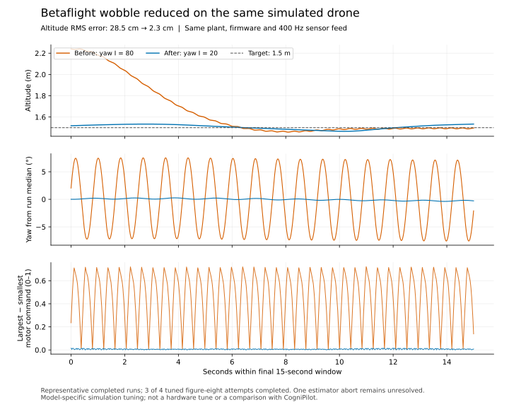

# Betaflight wobble investigation — October 1, 2026

Betaflight's large yaw oscillation is substantially reduced by changing **yaw
integral gain from 80 to 20** for the shared 2 kg RDD2 simulation. This is a
model-specific controller configuration change. The physics model, motor mapping,
firmware binary and sensor inputs were unchanged between the final paired runs.
This does not establish a tune for the physical drones.



## Measured result

These values use every 400 Hz CSV row in the final 15 seconds of each completed
run. Altitude error is relative to 1.5 m, not a 3D timed-path tracking score.
The two windows are aligned relative to their own ends; the underlying SITL is
wall-clock coupled and is not deterministic lockstep.

| Measurement | Before, yaw I = 80 | After, yaw I = 20 |
| --- | ---: | ---: |
| Altitude RMS error | 0.284719 m | 0.023342 m |
| Altitude range in window | 1.458200–2.239940 m | 1.465900–1.533901 m |
| Yaw peak-to-peak | 15.087° | 0.647° |
| Mean largest-minus-smallest motor command | 0.450529 | 0.006862 |
| Samples with any motor within 1% of a 0/1 limit | 2.1% | 0% |
| Peak altitude over entire run, including takeoff | 2.240280 m | 1.758382 m |
| Native integration checks | Passed | Passed |

Both runs used plant SHA-256
`79104cde9797bd890d48858633328df0526d44c1d8cf83a61008060f33aa0261`
and Betaflight binary SHA-256
`b77543e3df275d8fc58a7dd7f1a7b17eaf6e20c3fba87390de6334a4a849990e`.
Betaflight is pinned at `744f95fa31542c4c906f18072348a366ab11b6b7`
(2026.12.0-alpha), with no flight-code edits in this experiment.

The alternating diagonal motor commands and yaw oscillation decreased together
when only yaw I changed. This supports excessive yaw integral action for this
plant/bridge combination as a contributor. It is not proof that the bridge is
fully calibrated or that the same gain is appropriate on hardware.

## Repeats and unsuccessful experiments

- Three of four yaw-I-20 figure-eight attempts completed their autonomous windows.
  Completed-run altitude RMS errors were **2.22, 2.08 and 2.33 cm**.
- The fourth attempt aborted after 26.865 simulated seconds with native
  `FP_ABORT_ESTIMATOR` (reason 1): `positionEstimatorIsValidXY()` became false.
  Its earlier trailing window is retained but not compared as a completed run.
  The underlying cause is unresolved; estimator checks remain enabled.
- A shorter initial takeoff and neutral post-engagement throttle improved the
  hover diagnostic. Both settings changed together, so their individual effects
  have not been isolated. Figure-eight wobble persisted until yaw tuning.
- Raising the sensor bridge from 400 to 1600 Hz did not improve the untuned
  figure-eight case. The default remains **400 Hz**, with unchanged **1600 Hz**
  physics integration.
- The first Devenv hover-task attempt failed during upstream EEPROM provisioning
  with `malloc_consolidate(): unaligned fastbin chunk detected`. A fresh, explicit
  retry passed in 58.8 seconds including task prerequisites. This intermittent
  upstream setup problem is not fixed or hidden by an automatic retry.

The [machine-readable experiment record](results/betaflight-tuning.json) includes
successful and aborted flight reports, CSV-derived metrics and raw trajectory
hashes. Plotting CSVs are downsampled to 20 Hz; metrics use full-rate samples:
[before](results/betaflight-baseline-final-plot.csv),
[after](results/betaflight-tuned-final-plot.csv).
Full raw trajectories and logs remain under the experiment output directories.

## Code changes and use

The native Rust `betaflight-probe` now supports a stationary `--hover` diagnostic,
explicit sensor/takeoff/throttle/yaw settings, altitude/vertical-speed telemetry,
and trailing-window altitude and motor-limit metrics. Every completed flight
report records its settings. Defaults are:

| Option | Default |
| --- | ---: |
| `--sensor-hz` | 400 (also accepts 800 or 1600) |
| `--takeoff-ms` | 1000 |
| `--hold-throttle` | 1690 |
| `--yaw-p` | 45 |
| `--yaw-i` | 20 |
| `--heading-p` | 30 |

The fixed `ap_hover_throttle` is also 1690 for this model. Setting RC throttle
near it avoids commanding a manual climb/descent when applicable. Native
navigation retains its own altitude target while the mission is active.

After applying the dependency patch, from the workspace root:

```sh
devenv -P rdd2 tasks run rdd2:benchmark:betaflight:hover
devenv -P rdd2 tasks run rdd2:benchmark:betaflight:figure-eight
```

For a controlled before/after experiment, use the native command from
`src/cerebri_rdd2`, with a fresh output directory for each run:

```sh
cargo run --release --locked -p cerebri-rdd2-xtask -- betaflight-probe \
  ../betaflight/obj/main/betaflight_SITL.elf \
  ../modelica_models/artifacts/vehicles/rdd2/plant/Vehicles_Rdd2_Plant \
  artifacts/betaflight-experiment/before --yaw-i 80

cargo run --release --locked -p cerebri-rdd2-xtask -- betaflight-probe \
  ../betaflight/obj/main/betaflight_SITL.elf \
  ../modelica_models/artifacts/vehicles/rdd2/plant/Vehicles_Rdd2_Plant \
  artifacts/betaflight-experiment/after --yaw-i 20
```

Only one Betaflight instance can run at a time because its ports are fixed.
The adapter is a local simulator; these commands do not operate physical drones.
The Rust test suite passed **39 tests**, with **two opt-in firmware integration
tests not rerun**. The cumulative patch applies cleanly to its pinned RDD2 base.
The new Devenv hover task was executed, including its existing SIL prerequisite.

An exploratory 1600 Hz report incorrectly calculated duration with the old
400 Hz constant. Its CSV timestamps were correct; that report duration must not
be used. The adapter now computes reported duration from the selected rate.
A final 1600 Hz hover passed: its reported 38.403125 seconds matched the final
CSV timestamp, and its trailing 15-second metric window contained 24,000 rows.
The Devenv SIL prerequisite rebuilt the plant before the final hover checks;
those reports identify the new artifact hash separately. The paired figure-eight
comparison above used the same pre-rebuild binary in both runs.

## How TROPIC fits

The [official MR-VMU-TROPIC repository](https://github.com/NXP-Robotics/MR-VMU-TROPIC)
is a hardware reference, not a replacement vehicle dynamics model. Its README
lists BMI088 and ICM-45686 IMUs, BMM350 magnetometer, BMP390 barometer and an
RT1064 MCU; it links CogniPilot/PX4 support and mentions Zephyr. That does not
establish Betaflight support or identify the boards fitted to our drones.

To make both simulations represent the identical physical vehicles, next obtain:

| Model component | Required evidence |
| --- | --- |
| Rigid body | Measured mass, center of mass, arm geometry and inertia estimate |
| Motors/propellers | Thrust-versus-command data, motor time constant and limits |
| IMU and other sensors | Actual selected parts, axes, sample rates, filter settings, timestamped stationary/moving logs |
| Noise and latency | Measured bias, variance, transport delays and jitter |
| Autonomous navigation | Confirmed motion-capture or other feedback interface and its update rate |

Board part names alone do not supply those calibrated parameters. No invented
TROPIC noise values were added. Both stacks should receive the same calibrated
plant and sensor conditions before a performance ranking is attempted.

The [shared timed-reference adapter](figure-eight.md#limits-and-next-code-change)
remains the next architecture step. Betaflight's native path timing still differs
from CogniPilot's. Historical figure-eight plots retain the older flights. The updated
[Three.js replay](replay/) offers the tuned and baseline October 1 Betaflight
recordings alongside the original CogniPilot recording.
