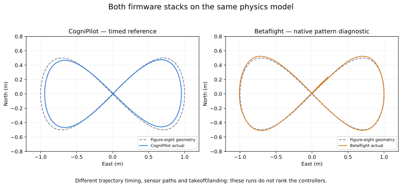
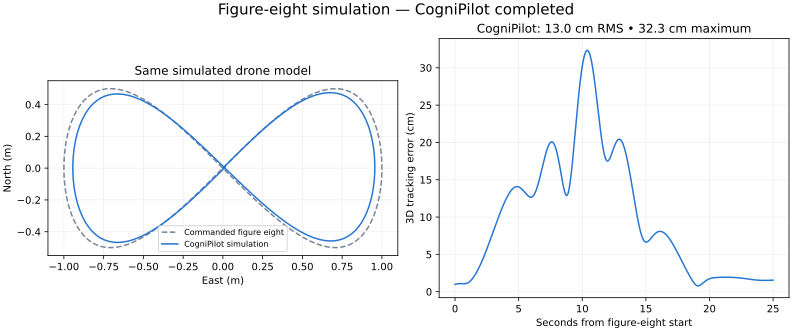

# Betaflight and CogniPilot figure-eight simulations

The semester target is autonomous figure-eight flight on two identical physical
drones, comparing Betaflight and CogniPilot. These runs demonstrate the software
connections on a common simulated vehicle. They do not yet predict the physical
drones' performance or provide a fair controller ranking.



Different trajectory timing means visual closeness alone cannot rank the controllers.

## Recorded results

| Item | CogniPilot | Betaflight |
| --- | --- | --- |
| Executed software | RDD2 Zephyr `native_sim`, existing benchmark patch | Real upstream SITL with native flight planning enabled |
| Flight | Takeoff, timed figure eight, hold, landing, disarm | Takeoff, 25-second native autonomous pattern window, simulation stopped |
| Simulated duration | 44.000 s / 70,400 physics steps | 37.680 s / 15,072 bridge steps, four physics substeps each |
| Completion checks | Passed; 500 commands, 31,500 reference echo checks | Passed integration check; 119 native HOLD observations, no mission abort; ARM/AUTOPILOT/ALTHOLD/POSHOLD stayed active |
| Tracking error | 0.129899 m RMS; 0.323328 m maximum | No comparable timed tracking score |
| Maximum altitude | 1.537021 m | 2.233707 m, including takeoff |
| End state | Landed and disarmed, z = 0.098366 m | z = 1.488166 m; landing is not qualified |

Both reports identify exactly the same plant binary:
`2b840fdee2a15aeeb80473f6ed6fa97a2404f7eefeb78d622e75df78e465fafa`.
The model description SHA-256 is
`0723b221f152cf4535e829c03922aeea7f8a70d48965813bb1a2f59afb7d5d28`.
See [machine-readable results](results/figure-eight.json).

The reference geometry is a Gerono figure eight: `east = sin(phase)`,
`north = sin(phase) cos(phase)`, at 1.5 m altitude. Its extents are 2 m east–west
and 1 m north–south. CogniPilot receives position, analytic velocity and fixed
yaw at 20 Hz; a minimum-jerk phase traverses one cycle in 20 seconds, followed
by a five-second hold. The scored interval is simulation time 8.5–33.5 seconds.
The RMS value includes that hold and is a 3D time-indexed error, not distance
to the nearest point on the curve.

Betaflight uses its upstream HOLD/FIGURE8 planner, with radius 100 cm, cruise
speed 30 cm/s and waypoint altitude 20150 cm above mean sea level. The simulation
origin is 200 m MSL. Its native phase law is different from the shared timed
reference. An identical-looking top-down curve therefore does not establish
identical tracking demands. The measured peak altitude also shows why the
horizontal plot alone is insufficient.



## Reproduce

Use the existing Linux RDD2 environment and apply the current dependency patches
as described in [patches/README.md](../patches/README.md). The build uses upstream
Betaflight commit `744f95fa31542c4c906f18072348a366ab11b6b7`, which identifies itself
as **2026.12.0-alpha**. This is not a claim about the installed drone firmware.
The config submodule resolved to `96910e90881573589b2a6c41f7392b7afad63973`.

From the workspace root, in its Devenv environment:

```sh
devenv -P rdd2 tasks run rdd2:benchmark:cognipilot:figure-eight
devenv -P rdd2 tasks run rdd2:benchmark:betaflight:figure-eight
```

The task definitions evaluate successfully. The flight results above were run
through the native Cargo commands below using the already-built plant and
firmware. The task graph additionally runs the existing SIL prerequisite.

Native workflows remain available. Build Betaflight from `src/betaflight`:

```sh
make TARGET=SITL EXTRA_FLAGS=-DENABLE_FLIGHT_PLANNING=1 -j1
```

Then, from `src/cerebri_rdd2`:

```sh
cargo run --release --locked -p cerebri-rdd2-xtask -- fastdyn-mission \
  --figure-eight \
  --native-sim "$PWD/build-native_sim/zephyr/zephyr.exe" \
  --shared-memory "$PWD/artifacts/cognipilot-figure-eight/lockstep.bin" \
  --plant-directory ../modelica_models/artifacts/vehicles/rdd2/plant/Vehicles_Rdd2_Plant \
  --report "$PWD/artifacts/cognipilot-figure-eight/report.json" \
  --trajectory "$PWD/artifacts/cognipilot-figure-eight/mission-trajectory.csv"

cargo run --release --locked -p cerebri-rdd2-xtask -- betaflight-probe \
  ../betaflight/obj/main/betaflight_SITL.elf \
  ../modelica_models/artifacts/vehicles/rdd2/plant/Vehicles_Rdd2_Plant \
  artifacts/betaflight-figure-eight/my-new-run
```

Use a fresh Betaflight output directory each time. Run only one Betaflight SITL
instance: its upstream ports are fixed (UDP 9002/9003/9004, TCP 5761).
The diagnostic launches and cleans up its own firmware process. It never connects
to physical hardware. `--figure-eight` leaves the earlier square diagnostic
available when that option is omitted.

## Artifacts and validation

CogniPilot emits `report.json`, `mission-trajectory.csv`, and
`commanded-trajectory.csv`. Betaflight emits `report.json`,
`mission-trajectory.csv` (including motor values), `mission-status.csv`, exact
`config.txt`, `provision.log`, `firmware.log`, and simulator `eeprom.bin`.
The final Betaflight evidence is `artifacts/betaflight-figure-eight/run-5/`;
run 4 also flew successfully but preceded the stronger mission-state checks.

The Rust suite passed **38 tests**; two opt-in native integration tests were not
rerun in this iteration because firmware ingress was unchanged. The added test
checks figure-eight endpoint holds and analytic velocity against a numerical
position derivative. Both current flight runs passed their stated checks.

Setup issues encountered and retained in logs:

- Ordinary VM shell lacked Make; the existing Devenv toolchain supplied it.
- Parallel initial Betaflight build hit a submodule Git lock race; serial build
  succeeded without changing flight code.
- Treating Betaflight as one-request/one-response lockstep stalled startup. The
  adapter now streams sensors at 400 Hz, holds the latest motor output, and
  advances the common plant at 1600 Hz. Stale motor streams abort the run.
- One isolated upstream configuration process crashed with
  `malloc_consolidate(): unaligned fastbin chunk detected`. Subsequent fresh
  configuration runs succeeded; the root cause is unresolved. Failed provisioning
  is not accepted as a successful flight.

## Limits and next code change

Betaflight source is unmodified. Its adapter converts FLU IMU and ENU state to
the upstream FDM packet, compensates the upstream mirrored GPS convention,
reconstructs the expected NWU attitude for the virtual magnetometer, and reorders
motors from BR/FR/BL/FL to the plant's FR/BR/BL/FL. It uses the normal attitude
estimator, not the direct-attitude bypass. GPS/barometer/magnetometer are ideal
simulation inputs at the bridge cadence. CogniPilot currently receives a
different sensor set and GNSS cadence. Neither run calibrates sensor noise to
physical hardware.

Betaflight's hover throttle is configured to 1690 for this common 2 kg model;
this is not a setting recommended for the physical drone. CogniPilot retains
its existing simulator-assisted takeoff/landing law. Betaflight uses a fixed
initial throttle followed by its native autonomous controllers. Clock behavior,
actuation update rate, initial navigation settling, heading behavior, and landing
also differ. No loop-latency or execution-jitter ranking is claimed.

**Next minimal code change:** add a timestamped position/velocity reference
input to Betaflight's native navigation boundary, with frame conversion and
reference echo/age checks, then feed the existing `reference::figure_eight`
values through it. This aligns the requested trajectory without introducing a
second physics model. Standardize sensor timing and takeoff/landing before
comparing errors. Choose a hardware command transport only after identifying the
installed firmware and position-feedback system.

The shared RDD2 plant still needs calibration to the identical physical drones.
The earlier pure Modelica runtime/qualification failures remain unresolved;
these successful firmware simulations do not establish that test has passed.
