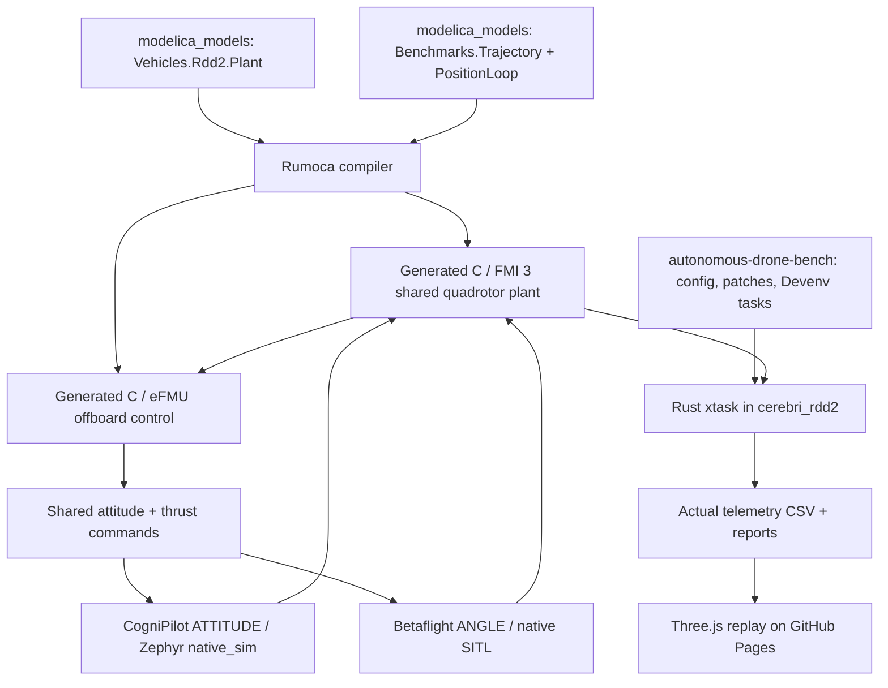

# Where the benchmark comes from

Audit date: **2026-10-09**. This map separates upstream source code, our modifications, generated artifacts, and display code. A Git commit identifies the upstream base; **base commit plus the workspace patch** identifies the source we actually run. A commit alone does not describe a dirty development checkout.

## From source to a flight

The diagram describes the **implemented shared-controller SIL architecture**. Both stacks have completed the commissioning figure eight; the full noisy/hardware qualification remains pending. Read [implementation status](shared-position-benchmark.md) before interpreting a replay as evidence for the new design.

## Repositories and exact versions

| Repository | Verified base revision | What it contributes / where it lives |
|---|---|---|
| [An1Sura/PURT-UAS_Autonomous_Drone_Racing](https://github.com/An1Sura/PURT-UAS_Autonomous_Drone_Racing) | This document's containing commit | Our configuration, dependency patches, experiment evidence, docs and website. It does not vendor entire firmware repositories. |
| [CogniPilot/cognipilot_workspace](https://github.com/CogniPilot/cognipilot_workspace) | Workspace ancestry, not a second installed dependency | Basis of root `devenv.nix`, `devenv/`, and `setup`. Do not clone another workspace inside this one. Root history identifies our actual orchestration code. |
| [CogniPilot/modelica_models](https://github.com/CogniPilot/modelica_models/tree/a41f7c0c00b55c1bf54f03c9b66b901ba8e43c6f) | `a41f7c0c00b55c1bf54f03c9b66b901ba8e43c6f` | `src/modelica_models`: `Vehicles.Rdd2.Plant`, motor/rigid-body models, `Vehicles.Rdd2.LogLinearController`, and `GuidanceController`. Our `Benchmarks.*` wrappers are additions preserved in a patch; they are not claimed as upstream features. |
| [CogniPilot/rumoca](https://github.com/CogniPilot/rumoca/tree/4d0e521d9a0bd2527808dbce2c5689834d1a0349) | `4d0e521d9a0bd2527808dbce2c5689834d1a0349` | `src/rumoca`: Modelica compiler. The exercised executable reports **0.10.0**. It generates the plant and the offboard C; it is not a flight stack. |
| [CogniPilot/cerebri_rdd2](https://github.com/CogniPilot/cerebri_rdd2/tree/bf784c752f7767bd1a8712a7fc64c5b522000323) | `bf784c752f7767bd1a8712a7fc64c5b522000323` | `src/cerebri_rdd2`: CogniPilot firmware; `xtask/src/physics.rs` loads the FMI plant; `benchmark.rs`, `cognipilot.rs`, and protocol/shared-memory modules implement the exchange. Our native benchmark tooling is preserved in `cerebri-rdd2-benchmark.patch`. |
| [betaflight/betaflight](https://github.com/betaflight/betaflight/tree/744f95fa31542c4c906f18072348a366ab11b6b7) | `744f95fa31542c4c906f18072348a366ab11b6b7` | `src/betaflight`: actual Betaflight SITL firmware and its simulator UDP / MSP interfaces. The adapter is **our Rust code**, not a downloaded NXP or CogniPilot adapter. October 5 recordings used our navigation research patch; that control change is not allowed in the new PDF comparison. |
| [CogniPilot/zephyr](https://github.com/CogniPilot/zephyr/tree/5ddc8c25b49aa10b5daf0ac7555baaf0f12ecc83) | `5ddc8c25b49aa10b5daf0ac7555baaf0f12ecc83` | `.devenv/state/west/rdd2/zephyr`: RTOS/runtime for RDD2 `native_sim` and later embedded builds. Zephyr is inside the CogniPilot firmware; it does not run Betaflight. |
| [CogniPilot/cerebri_modules](https://github.com/CogniPilot/cerebri_modules/tree/ef73a4f8adeb4385c34af4344c9af27e43e02033) | `ef73a4f8adeb4385c34af4344c9af27e43e02033` | `src/cerebri_modules`: common Cerebri firmware modules consumed by the RDD2 build. |
| [CogniPilot/zros](https://github.com/CogniPilot/zros/tree/20ab07983224ca078f17e2e851b4fe8cb92eb517) | `20ab07983224ca078f17e2e851b4fe8cb92eb517` | `src/zros`: embedded topic/message transport used by CogniPilot. Not a separate physics engine. |
| [CogniPilot/csyn](https://github.com/CogniPilot/csyn/tree/e0139e68d5e2db6fcaa6420a786b65cd1f8b035f) | `e0139e68d5e2db6fcaa6420a786b65cd1f8b035f` | `src/csyn`: synchronization support used by the firmware build. |
| [CogniPilot/synapse_fbs](https://github.com/CogniPilot/synapse_fbs/tree/c7df213e48bccb414521de405474c7bca8952a74) | `c7df213e48bccb414521de405474c7bca8952a74` | `src/synapse_fbs`: generated C message schemas. Rust xtask also pins the registry crate `synapse_fbs = 0.9.0`; its resolved package is in Cargo.lock. These are separate build inputs, not interchangeable revision labels. |
| [jgoppert/FastDyn](https://github.com/jgoppert/FastDyn/tree/94c85f3e47be410e8d760b7f8207eb1580d7cd4c) | `94c85f3e47be410e8d760b7f8207eb1580d7cd4c` (**West declaration**, not audited runtime checkout) | Optional binary-in-the-loop / ARM rehosting workflow. It is **not** the source of the quadrotor physics in the native SIL recordings. `physics.rs` loads Rumoca-generated FMI directly. |
| [CogniPilot/gnc_lean](https://github.com/CogniPilot/gnc_lean/tree/0c01537b94677d38c0547a72c1dc12a7e87db234) | `0c01537b94677d38c0547a72c1dc12a7e87db234` (Lake lock) | Mathematical library for `proofs/`. This is not linked into the flight executable. Existing exact-real benchmark proofs do not prove generated floating-point code, controller stability, or hardware performance. |
| [leanprover-community/mathlib4](https://github.com/leanprover-community/mathlib4/tree/5e932f97dd25535344f80f9dd8da3aab83df0fe6) | `5e932f97dd25535344f80f9dd8da3aab83df0fe6` (Lake lock) | Lean mathematical dependencies. See `proofs/lake-manifest.json` for the complete proof dependency closure. |
| [mrdoob/three.js](https://github.com/mrdoob/three.js/tree/r180) | Browser imports `three@0.180.0` from esm.sh | Scene rendering, camera controls, lines and illustrative drone geometry. It displays telemetry; it does not calculate flight physics or validate a controller. CDN/network access is required by the current page. |
| [NXP-Robotics/MR-VMU-TROPIC](https://github.com/NXP-Robotics/MR-VMU-TROPIC) | Reference only; no runtime revision consumed | Hardware integration reference. It is not the mass/inertia source, not a Betaflight adapter, and not a claim that our physical RT1060 boards, wiring or motor calibration match that repository. |

Dependency checkout revisions above were read from the existing Linux VM on the audit date unless explicitly labeled as workspace ancestry, lock-file, manifest or reference evidence. For firmware-provider resolution, inspect `src/cerebri_rdd2/build-native_sim/rdd2-resolved-providers.txt`; do not infer actual providers solely from a West manifest when local overrides are possible.

## Files and artifacts to inspect

| Question | Location |
|---|---|
| What course is now requested? | [`config/shared-position-benchmark.json`](config/shared-position-benchmark.json): **10 m × 10 m, z = 2 m, one lap**. |
| What is known about PURT? | [`config/purt-environment.json`](config/purt-environment.json), [facility evidence](purt-environment.md). Published envelope is approximate; current MoCap coverage/obstacles remain unmeasured. |
| Where is physics defined? | `src/modelica_models/Vehicles/Rdd2/Plant.mo` and its referenced model classes. |
| Which plant is actually loaded? | `src/modelica_models/artifacts/vehicles/rdd2/plant/Vehicles_Rdd2_Plant/`: shared library and `modelDescription.xml`; native reports record hashes. The old `AvionicsPlant` name is not the current loaded artifact. |
| Where is the new offboard math? | `src/modelica_models/Benchmarks/{Trajectory,PositionLoop}.mo`, preserved by [`../patches/modelica-shared-position.patch`](../patches/modelica-shared-position.patch). `PositionOracle.mo` is a test wrapper, not a flight controller. |
| Where is the numerical check? | `src/cerebri_rdd2/xtask/src/shared_loop.rs` and thin `shared_loop_shim.c`, preserved in the Cerebri patch. |
| What was generated? | `artifacts/shared-loop/Benchmarks_*.efmu`, their unpacked `ProductionCode/`, `libshared_loop.so`, compiler logs, `reference.csv`, `checks.json`. These are generated build artifacts, not new upstream sources. |
| Where are current actual flights? | [`results/shared-sil/`](results/shared-sil/). New native flight telemetry, hashes and failed-attempt reports; old replay payloads have been removed. |
| What code paints the page? | [`sim/`](sim/), with reference geometry/statistics in [`planner/math.js`](planner/math.js). |

## Linux, Nix, Rust and the hardware boundary

The exercised VM is **Ubuntu 24.04.4 LTS on Linux**, managed by Lima on the Mac. **Nix/Devenv** provides development packages and task coordination. Calling this VM “NixOS” would be inaccurate. Native **Cargo/Rust**, **West/CMake**, and Betaflight **Make/C** still own their builds. Zephyr is an **RTOS used by CogniPilot**, separate from the host Linux operating system.

`devenv.lock` pins environment inputs; RDD2's West manifest pins its embedded dependencies; Cargo.lock pins Rust packages; `proofs/lake-manifest.json` pins Lean packages. `patches/README.md` identifies local source changes. These layers have different jobs. To reproduce an experiment, preserve all applicable locks **and** patches **and** report hashes.

The NXP RT1060 board, IMU choice, bus rates, driver timing, radio/trainer transport, QTM calibration and end-to-end hardware latency still need separate measurements. Neither a fast SIL run nor the published MoCap frame rate measures those latencies. The model currently represents a shared RDD2 test vehicle, not a fully measured model of the identical physical drones.

## October 9 source refresh and native harness

Fetched upstream updates for `cerebri_rdd2`, `modelica_models`, `rumoca`, `cerebri_modules`, `zros`, `csyn` and `synapse_fbs`; preserved the tested revisions above and local changes. See [fetch log](results/shared-sil/source-fetch.log). Fetching is not silently upgrading an experiment.

`xtask/src/shared_sil.rs` is our new native shared-controller flight harness. `betaflight-sitl-lockstep.patch` changes simulator transport, clock/scheduler coordination and Dyad startup only; no flight-control or estimator algorithms are replaced. Both receivers require reversing the shared ENU yaw command when encoding RC channel 4.

The ideal-attitude isolation plant adds an optional rigid-body attitude override, default disabled. Real firmware runs load the unchanged full-dynamics plant artifact identified by their report hash. Ideal tests are not firmware flights.

The ideal FMI source build uses official [modelica/fmi-standard](https://github.com/modelica/fmi-standard/tree/b8778deaf5b746ba4a2f6c155d53f8a33eebbd33) v3.0.2 C headers, commit `b8778deaf5b746ba4a2f6c155d53f8a33eebbd33`; these are compile-time interface headers, not a second physics model.
