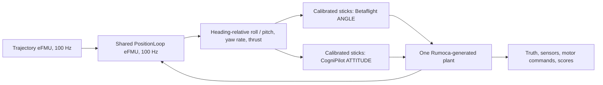
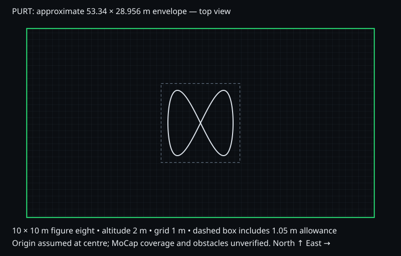

# PDF-aligned PURT benchmark

Updated **2026-10-08**, following the user-supplied *CogniPilot vs Betaflight Flight Control Benchmark.pdf*. This document is an implementation/status record, not a claim that all PDF stages have passed.

## Course and goal

The active configuration is [`shared-position-benchmark.json`](config/shared-position-benchmark.json). Fly **one figure eight occupying 10 × 10 m horizontally, at constant altitude z = 2 m** above the assumed floor origin. Here `height_m` means the north–south footprint; `altitude_m` means vertical flight height. Scale is 1 and the centre is [0, 0].

Our research goal remains improving CogniPilot relative to the Betaflight baseline. The PDF first requires a fair shared-position-loop comparison; a fastest-lap claim comes only after accurate, repeatable flights under matched conditions. The initial **80 s lap target** is a deliberately slow commissioning setting, not a measured or optimized result. Warmup, arming, takeoff, hold and landing are separate from that lap clock.

| Quantity | Mathematical reference, not flight telemetry |
|---|---:|
| One-lap / total path length | 47.147 / 47.147 m |
| Lap target | 80 s |
| Mean / peak required speed | 0.589 / 1.646 m/s |
| Peak lateral acceleration | 0.407 m/s² = 0.0415 g |
| Peak total horizontal acceleration | 0.413 m/s² |
| Tightest turn radius | 0.597 m |

With u = t/T clamped to [0,1], q = 2π(10u³ − 15u⁴ + 6u⁵), the reference is x = 5 sin(q), y = 5 sin(2q), z = 2. Velocity and acceleration are analytic derivatives. The phase starts and stops smoothly; velocity is not constant. Path length integrates the tangent norm over q ∈ [0,2π]. Curvature is |x′y″−y′x″|/(x′²+y′²)^(3/2); lateral acceleration is curvature × speed². Published statistics use 20,000-interval numerical sampling in `docs/planner/math.js`, not a formal numerical error bound. Full numbers and sweeps are in [`course-stats.json`](results/shared-position/course-stats.json).

## What changes from the old experiment



This is the target wiring. The generated components now exist and pass the numerical checks below. The complete stack flight harness is **not yet connected and qualified**.

- Both stacks must receive the same trajectory and the same offboard position-controller output. Neither gets its own native position planner in the qualifying comparison.
- `Benchmarks.PositionLoop` wraps the existing RDD2 log-linear controller. It converts the desired thrust direction into tilt relative to the **current heading**, clamps roll/pitch to 35°, and emits yaw rate and collective thrust. No extra tilt compensation is applied to thrust, because the controller has already computed the force magnitude.
- The common yaw limit is 200°/s. CogniPilot's native full-stick mapping is 3.5 rad/s; its stick conversion must use that denominator so the physical requested rate agrees with Betaflight's 200°/s configuration.
- CogniPilot uses stock ATTITUDE mode; Betaflight uses stock ANGLE mode. Gains may be tuned under the same step-response criterion and budget. Do not carry the October 5 Betaflight navigation algorithm changes into this comparison.
- Both eFMUs are offboard. Firmware still uses its existing four generated controller blocks; `src/efmi.cmake` is unchanged.
- Generated C uses float32 and has single-instance, non-reentrant scratch storage. Call it serially. The trajectory uses an integer sample count to avoid accumulated floating-point clock drift. First disengaged output is t = 0; each engaged step advances the reference by 0.01 s, so the harness must pair each sample with that timestamp.
- Stick transmission at 250 Hz, sensor sampling, noise, delay and actuation need explicit simulation-time scheduling. A 100 Hz controller does not imply a 100 Hz IMU or motor loop. CogniPilot's historical 1600 Hz exchange does not divide evenly into 250 Hz; this must be handled explicitly rather than rounded silently.

## Verified on the existing Linux VM

| Check | Result and scope |
|---|---|
| Generate Trajectory, PositionLoop and test-only PositionOracle eFMUs | Passed with pinned Rumoca 0.10.0; generated C compiled into a host library. |
| Shared 10 × 10 m reference | 8,001 samples at 100 Hz over 80 s including both endpoints; bounds approximately [−5, −5, 2] to [5, 5, 2]. |
| Two reference repeats | Exactly equal output arrays. This is **not** a claim of deterministic firmware flights. |
| Analytic f64 versus generated float32 p/v/a | Maximum absolute component error 0.00004364 (units depend on the component); sample-time error ≤5.50 µs. |
| PositionLoop versus GuidanceController POSITION oracle | Maximum tested difference 0 for thrust, desired quaternion and integral across the sampled yaw/state trajectory. Both use the same 0.01 s period and 0.7 correction fraction for this comparison. |
| Clamp / disengage checks | Finite outputs, command limits, integral reset and disengaged-invalid output checks passed. |
| Rust regression suite | **43 passed, 0 failed, 2 ignored**; the ignored tests require separate native-firmware integration setup. |
| Betaflight unchanged-control SITL build | Passed with `ENABLE_SIMULATOR_GYROPID_SYNC=1` and transport-only fixes. Binary SHA-256: `47b3356e983aa85c45af864d65e6b1a316a339ddbc74f7f5bc752ebe266333f0`. |

Machine evidence: [`checks.json`](results/shared-position/checks.json) contains compiler, source, eFMU, C-shim and library hashes; [`rust-tests.log`](results/shared-position/rust-tests.log) preserves the native test results. The fresh Betaflight build initially hit a parallel submodule `.git/config` lock race; sequential submodule initialization fixed it. The [initial failure log](results/shared-position/betaflight-stock-build-initial-failure.log) is retained.

These are numerical/build checks, **not mathematical proofs of the controller or of full flight behavior**. Existing Lean proofs do not automatically establish refinement of this float32 implementation. See [formal-verification scope](formal-verification.md).

## Remaining gates and why there is no new flight replay yet

1. **Packet lockstep:** source inspection confirms that Betaflight's synchronization flag gates `taskMainPidLoop`, but `micros64()` and `millis64()` still integrate `nanos64_real()` multiplied by `simRate`. `updateState()` derives `simRate` from wall-clock packet spacing. Therefore the flag alone does not establish the PDF's simulation-time contract. A sequence-aware sensor/motor adapter and deterministic clock qualification are still required. We have not claimed a failed repeatability experiment that was never run.
2. **Ideal-attitude shared-plant check:** the generated position loop still needs a hover and slow-square test against the shared plant with ideal attitude, before stack integration. The oracle test does not replace this gate.
3. **Common full-flight runner:** implement calibrated stick mappings, normal arming/estimator readiness, shared takeoff altitude ramp, 10 s hover, 0.5 m step, square, one figure eight, shared landing and native disarm/ground/motor-stop verification. Measure Betaflight hover throttle and select/log RC smoothing. Existing native-position adapters reject the new 1:1 geometry or use a different controller; bypassing those checks would create an invalid comparison.
4. **Noise / performance campaign:** define common seeded gyro/accelerometer noise and vibration; run none/realistic/harsh with at least five seeds per condition, alternate stack order, and shorten lap targets until the agreed accuracy limit fails. Preserve all attempts and distinguish host execution time from flight time.
5. **Hardware phases:** PC MoCap-to-trainer/SBUS Rust bridge, matched physical aircraft calibration, onboard timing/logging and latency tests remain separate. Existing simulation does not measure NXP RT1060 driver latency or certify the radio/mocap safety behavior.

The PDF's example noninferiority margins are examples, not a pass criterion adopted after seeing data. Agree margins before the campaign. No new stock-mode 10 × 10 m lap, landing or speed advantage is claimed here.

## PURT fit and preview



The assumed envelope is 53.34 × 28.956 × 9.144 m, centred on an assumed floor origin. With 0.4 m vehicle radius + 0.15 m tracking allowance + 0.5 m wall margin, the 10 × 10 m reference plus margins spans **12.1 × 12.1 m**, z = **0.95 to 3.05 m**. It fits that box. The envelope-only maximum scale is approximately **2.6856** (26.856 × 26.856 m footprint at the same altitude); this is **not** an approved flyable scale.

Overall fit remains **unverified** because current calibrated MoCap coverage and obstacle boxes are unknown. Measure the origin/axis orientation, clear wall/net limits, lowest overhead obstruction, columns/stairs/mezzanine/equipment/camera stands, and the usable calibrated coverage at 2 m altitude. Published total floor area is not the clear flight area. Camera sample rate and calibration residuals are not end-to-end latency or a measured noise distribution.

The existing black grid and green boundaries are retained. The site displays the new course as a **static reference preview**; its historical tabs show actual unmodified 8 × 4 m, z = 1.5 m recordings. Old recordings are never stretched or retimed to stand in for a new simulation.

## Reproduce component checks

Apply the documented source patches first; see [`patches/README.md`](../patches/README.md).

```sh
devenv -P rdd2 tasks run rdd2:benchmark:shared-loop:check
```

Native equivalent, with Rumoca and a C compiler available:

```sh
cargo run --release --locked --manifest-path src/cerebri_rdd2/xtask/Cargo.toml -- \
  shared-loop-check docs/config/shared-position-benchmark.json src/modelica_models \
  .devenv/state/results/rumoca/bin/rumoca artifacts/shared-loop
```

Outputs include `Benchmarks_*.efmu`, unpacked generated C, compiler logs, `libshared_loop.so`, `reference.csv` and `checks.json`. The CSV is **commanded reference data**, not drone telemetry. The command currently rejects unsupported placement/controller settings rather than silently ignoring them. It is a commissioning check for the fixed course, not an editable mission-planning UI.

For the complete source provenance, versions, and hardware-reference distinction, use [the repository map](repository-map.md).
