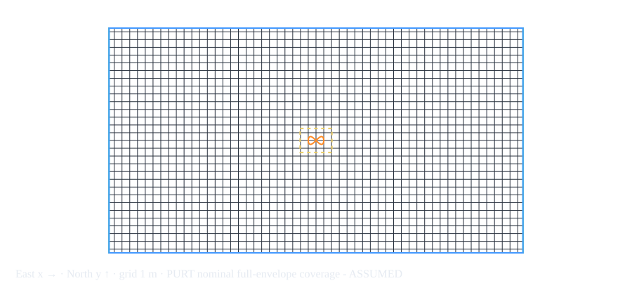

# Configurable figure-eight timing rundown

[Open the editable planner](planner/) · [Open recorded flights](replay/)

## Setup

Configuration: [figure-eight.json](config/figure-eight.json). Base width 2 m, height 1 m, scale 1, altitude 1.5 m; two 20-second laps and a 5-second end hold. The same Rumoca plant and 2 kg vehicle are retained. Only Betaflight uses a different native phase law. The planner is a calculation tool, not a firmware simulation in the browser.

Path per lap: **6.097223 m**; total lap path: **12.194447 m**. These exclude takeoff/landing and the stationary end hold. Mean required speed 0.304861 m/s; peak 0.833041 m/s; peak lateral acceleration 0.665732 m/s² (0.067886 g); tightest geometric turn radius 0.208756 m.

## Size and timing sweeps (calculated, not additional firmware runs)

### Several sizes at 20 s/lap

| Scale | Lap (s) | Path/lap (m) | Mean speed (m/s) | Peak speed (m/s) | Peak lateral (m/s²) | g |
|---|---|---|---|---|---|---|
| 0.5 | 20 | 3.049 | 0.152 | 0.417 | 0.333 | 0.034 |
| 1 | 20 | 6.097 | 0.305 | 0.833 | 0.666 | 0.068 |
| 2 | 20 | 12.194 | 0.610 | 1.666 | 1.331 | 0.136 |
| 3 | 20 | 18.292 | 0.915 | 2.499 | 1.997 | 0.204 |

### Several lap times at scale 1

| Scale | Lap (s) | Path/lap (m) | Mean speed (m/s) | Peak speed (m/s) | Peak lateral (m/s²) | g |
|---|---|---|---|---|---|---|
| 1 | 5 | 6.097 | 1.219 | 3.332 | 10.652 | 1.086 |
| 1 | 10 | 6.097 | 0.610 | 1.666 | 2.663 | 0.272 |
| 1 | 20 | 6.097 | 0.305 | 0.833 | 0.666 | 0.068 |
| 1 | 30 | 6.097 | 0.203 | 0.555 | 0.296 | 0.030 |
| 1 | 40 | 6.097 | 0.152 | 0.417 | 0.166 | 0.017 |

## Actual firmware runs, October 2

| Stack | Lap/reference timing | Recorded total (s) | Tracking RMSE / max (m) | Landing |
|---|---|---|---|---|
| CogniPilot | 2 × 20 s; starts at 9 s, lap ends 29 / 49 s, hold ends 54 s | 69.000 | 0.13844 / 0.33321 | Passed; simulator-assisted descent/disarm |
| ArduPilot | 2 × 20 s; starts at 110 s, lap ends 130 / 150 s, hold ends 155 s | 165.000 | 0.09634 / 0.24131 | Passed; normal Guided takeoff then LAND |
| Betaflight | 40 s native pattern window; nominal native period 20.268 s after 31 cm/s quantization; not the shared minimum-jerk clock | 54.960 | Not scored against the shared timed reference | Passed on repeat; native LAND and automatic disarm |

The first Betaflight config attempt aborted at 17.2225 simulated seconds with native estimator reason 1. It is retained in [the failed report](results/configurable/betaflight-aborted-report.json). A fresh repeat passed without disabling arming or estimator checks. The native pattern window does not guarantee exactly two completed laps: its own phase rate, initial phase and clock differ. Do not report its 54.960 s recording duration as a competitive two-lap score.

The total duration includes setup and post-flight observation. CogniPilot includes 1 s readiness/warmup, 8 s arm/takeoff, 40 s laps, 5 s hold, 10 s landing allowance and 5 s observation. ArduPilot includes 90 s warmup, 20 s arm/takeoff, 40 s laps, 5 s hold and 10 s landing allowance. Betaflight is event-driven and wall-clock coupled; its profile overhead fields are planning estimates, not enforced schedules.

## Cumulative laps and error against the timing target

| Stack | Lap | Cumulative reference distance (m) | Cumulative reference time (s) | Target end on sim clock (s) | 3D RMSE (m) | Endpoint error (m) |
|---|---|---|---|---|---|---|
| cognipilot | 1 | 6.097 | 20.000 | 29.000 | 0.14674 | 0.01994 |
| cognipilot | 2 | 12.194 | 40.000 | 49.000 | 0.14669 | 0.01905 |
| ardupilot | 1 | 6.097 | 20.000 | 130.000 | 0.10653 | 0.06417 |
| ardupilot | 2 | 12.194 | 40.000 | 150.000 | 0.09366 | 0.05612 |

These are commanded lap deadlines, not stopwatch measurements of reaching a gate. Errors compare ground truth with the continuous reference at the same simulation timestamp; no nearest-path matching or post-hoc time shifting is used. Endpoint distance says how close the vehicle was at the requested deadline. Overall report RMSE includes the 5-second terminal hold; per-lap rows exclude it. Betaflight has no comparable cumulative timed-reference score yet.

## Profiles, feasibility and sensor fields

Each `(stack, mode)` profile has editable speed and lateral-acceleration limits, tracking/lag factor, lag seconds, arm/takeoff time, warmup, landing allowance and requested sensor rate/delay/noise. Default limits (2 m/s, 2 m/s²) and factor 1.2 are assumptions, not measurements of stack capability. Profiles may be added for other modes; native runners accept only implemented modes.

The reserve factor f multiplies required peak speed by f and lateral acceleration by f². The minimum lap duration is T × max(f·v_peak/v_limit, sqrt(f²·a_lat_peak/a_limit)); the larger term identifies speed or corner acceleration as the binding limit. At default size this gives 13.847 s with the assumed limits. At 10 s/lap corner acceleration fails; at scale 3 and 20 s/lap speed is the tighter limit. This is a necessary kinematic check, not a controller stability proof.

Ingress settings are explicit: CogniPilot 1600 Hz lockstep, Betaflight 400 Hz streamed, ArduPilot 1600 Hz JSON physics exchange with internally generated sensors. External delay/noise defaults to zero; nonzero requests are rejected by the native runners until implemented, rather than silently ignored. Internal GNSS/estimator paths remain different. Published PURT camera rates are capture capabilities, not proven end-to-end update rates or a noise distribution.

## PURT fit

Current fit is **unverified** because the current calibrated mocap region and obstacle inventory are missing. The approximate published 53.34 × 28.956 × 9.144 m envelope supports a **nominal upper-bound scale 25.62** with the configured 1.05 m inflation and assumed full-volume coverage. The real largest permissible scale remains unknown. [Environment evidence and exact survey checklist](purt-environment.md). The small assumed example rejects scale 1 and suggests 0.9 because its mocap width is limiting.

## How the geometry is calculated

Let A = width × scale / 2, B = height × scale / 2. Position is x = cx + A sin θ, y = cy + B sin(2θ), z = altitude. Every lap uses u = t/T and θ = 2π(10u³ − 15u⁴ + 6u⁵), with zero velocity/acceleration at each lap boundary. Yaw is vehicle heading, not a rotation of the figure eight.

Path length integrates sqrt((A cos θ)² + (2B cos 2θ)²) over 0..2π using 20,000 trapezoidal intervals. Mean speed is L/T. Peak speed and acceleration use analytic first/second derivatives, sampled at 20,001 times. Curvature κ = |x′y″ − y′x″| / (x′²+y′²)^(3/2); tightest radius is 1/max κ. Lateral acceleration is v²κ; horizontal acceleration additionally includes tangential acceleration. g uses 9.80665 m/s². These sampled extrema are numerical estimates, not exact symbolic maxima.

Uniform scale k multiplies length, speeds, accelerations and radius by k at fixed T. Changing T multiplies speed by 1/T and acceleration by 1/T², while length/radius stay fixed. The browser and Rust calculations were checked to agree within 1e-9 for the default config.

## ArduPilot parameter mapping and comparability

The earlier square diagnostic (0.06252 m RMSE) remains historical; it is not this figure-eight score. The same pinned Copter-4.7.1 source revision and executable are reused. This pinned revision defines `WP_SPD` in m/s and `WP_ACC` in m/s², so the default profile writes `WP_SPD 2` and `WP_ACC 2` into `probe.parm`. The older equivalents would be `WPNAV_SPEED 200` cm/s and `WPNAV_ACCEL 200` cm/s². Do not send both parameter generations blindly. [Pinned parameter definitions](https://github.com/ArduPilot/ardupilot/blob/dbe792162d06cab66c3475fd5556bf7a120f119e/libraries/AC_WPNav/AC_WPNav.cpp).

ArduPilot and CogniPilot receive the same position/velocity/yaw reference at 20 Hz from the same config. ArduPilot retains 90 s estimator warmup and normal arming checks, converts ENU/FLU to local NED/FRD, and lands with its normal command. Betaflight maps supported 2:1 geometry to native radius/cruise/hold commands but does not consume this exact timed reference. Unsupported native geometry is rejected.

**No stack ranking is supported:** sensor paths, internal filtering/noise, takeoff/landing logic, estimator warmup and actuator transfer functions remain unmatched. ArduPilot JSON exchange is step-coupled; CogniPilot uses shared-memory lockstep; Betaflight uses wall-paced SITL streams. Exchange latency includes host scheduling/transport and is not pure controller execution time. Limits/lag fields are assumptions until identified experimentally.

## Reproduce

Run `devenv -P rdd2 tasks run rdd2:benchmark:plan` for the tables/fit, then the individual `rdd2:benchmark:cognipilot:figure-eight`, `rdd2:benchmark:ardupilot:figure-eight`, and `rdd2:benchmark:betaflight:figure-eight` tasks. Edit `docs/config/figure-eight.json` first; download the same format from the planner. Run only one instance of each firmware at a time. The native commands remain usable through Cargo without Devenv. After flight-logic changes, rerun affected simulations, preserve failures and refresh the embedded recordings plus source/export together.

## Validation evidence

43 native unit/protocol tests passed, two ignored. The canonical Devenv planning
task passed and the cumulative patch applies to the pinned source. A second
CogniPilot run at scale 0.5, 30 s/lap and one lap also passed takeoff/reference/landing,
confirming geometry and downstream duration change in the real runner. Its
[report](results/configurable/scaled-cognipilot-report.json) embeds that config.
The sweeps remain calculated requirements; they are not a claim that every sweep
row was flight-tested. The PURT example's native fit checker exits nonzero on
a known geometric conflict; missing coverage reports unverified.

